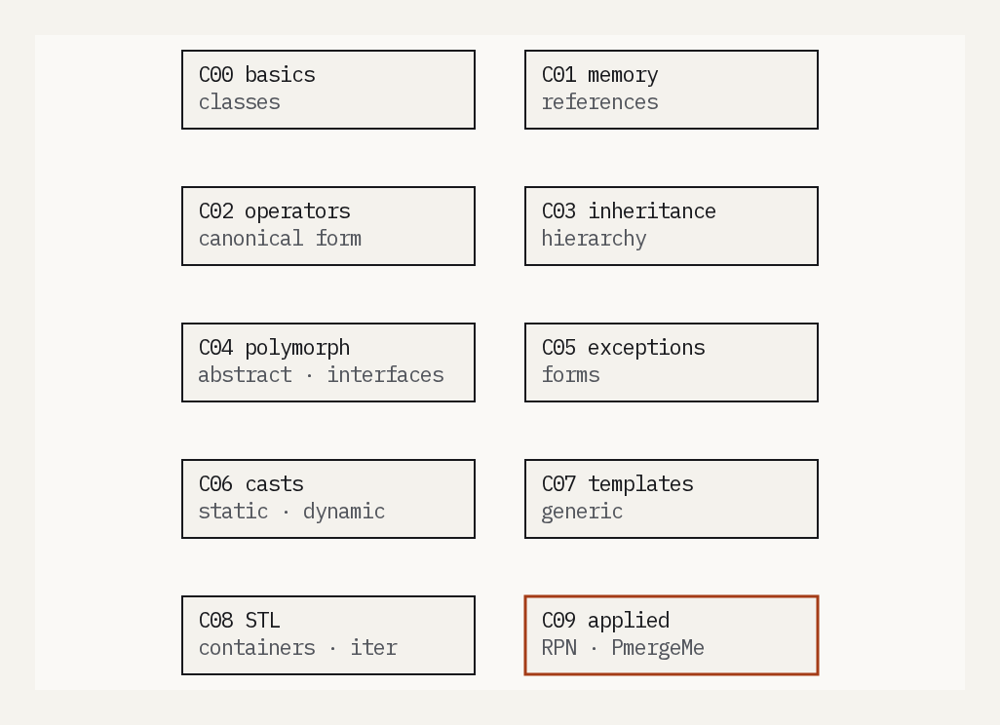
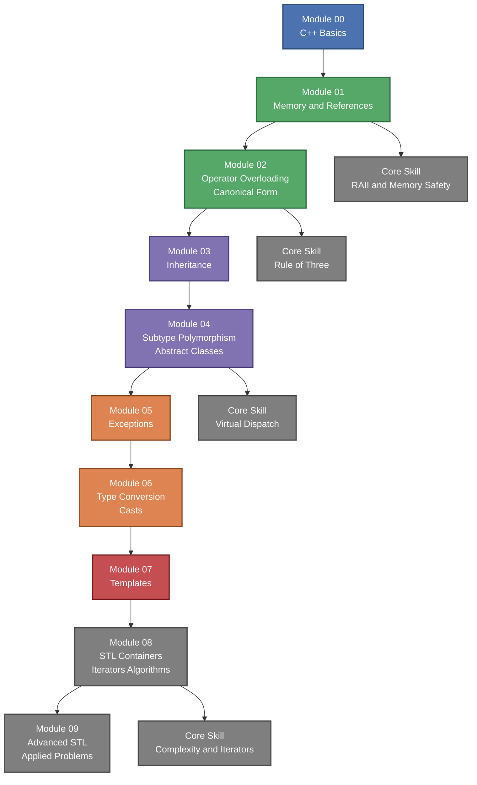

# C++ Modules - Advanced Object-Oriented Programming

📌 **42 School - C++ Specialization Track**  

## ▌ Description
The **C++ Modules** series is a comprehensive deep dive into **Object-Oriented Programming (OOP)**, memory management, and advanced C++ features.  
The goal of these modules is to progressively introduce **polymorphism, operator overloading, exceptions, STL, and advanced templates** while strictly following **C++98** standards.




## ▌ Key Concepts Covered
▸ **Memory Management & Pointers**  
▸ **Ad-hoc & Subtype Polymorphism**  
▸ **Operator Overloading**  
▸ **Exception Handling**  
▸ **Abstract Classes & Interfaces**  
▸ **Templates & STL (Standard Template Library)**  

## ▌ Result: **All 10 modules validated**
All **10 modules** were successfully completed, covering core and advanced C++ topics. 🎉

## ▌ **Modules Overview**
| 📌 Module | Description |
|----------|-------------|
| **Module 00**  | Introduction to C++ - Namespaces, classes, member functions, and initialization lists |
| **Module 01**    | Memory allocation, pointers to members, references, and switch statements |
| **Module 02**    | Ad-hoc polymorphism, operator overloading, and Orthodox Canonical Form |
| **Module 03**    | Inheritance and class hierarchy |
| **Module 04**    | Abstract classes, interfaces, and subtype polymorphism |
| **Module 05**    | Exception handling and bureaucratic form processing |
| **Module 06**    | Type conversion and C++ casting (`static_cast`, `dynamic_cast`, `reinterpret_cast`) |
| **Module 07**    | Function and class templates |
| **Module 08**    | STL Containers, Iterators, and Algorithms |
| **Module 09**    | Advanced STL - Bitcoin Exchange, Reverse Polish Notation, Merge Sorting |

## ▌ Example Implementations
### ■ **Module 02 - Operator Overloading**
- Implemented a **fixed-point arithmetic class** with overloaded operators.
- Ensured proper **copy constructor, assignment operator, and destructor**.

### ■ **Module 04 - Polymorphism**
- Designed an **Animal hierarchy** using **abstract classes**.
- Implemented **virtual destructors** and **dynamic binding**.

### ■ **Module 08 - STL Algorithms**
- Created a **custom container manipulator**.
- Implemented **iterators**, a templated `easyfind`, and used **`std::sort`**.

## ▌ Compilation & Usage
### ■ **Compile a Module** (each `CXX/exYY` folder has its own Makefile)
```sh
make
``` 

### ■ **Run an Example (e.g., Polymorphism)**
```sh
cd C04/ex02 && make && ./abstract  
```

## 📜 License

This project was completed as part of the **42 School** curriculum.  
It is intended for **academic purposes only** and follows the evaluation requirements set by 42.  

Unauthorized public sharing or direct copying for **grading purposes** is discouraged.  
If you wish to use or study this code, please ensure it complies with **your school's policies**.
